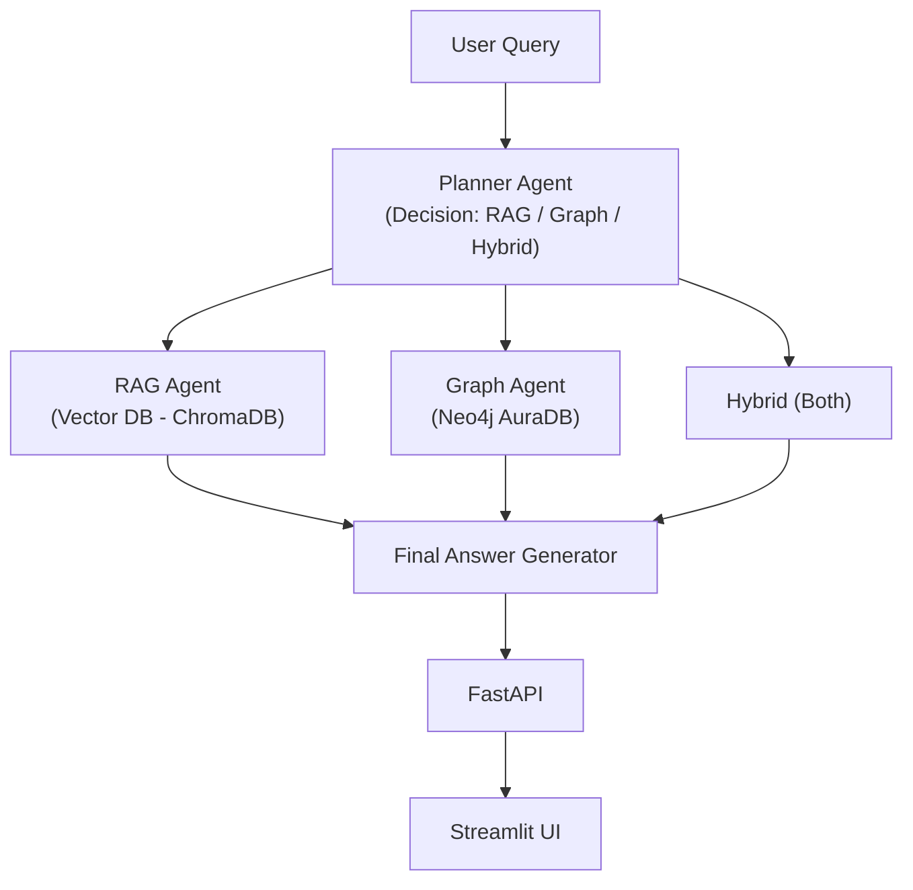
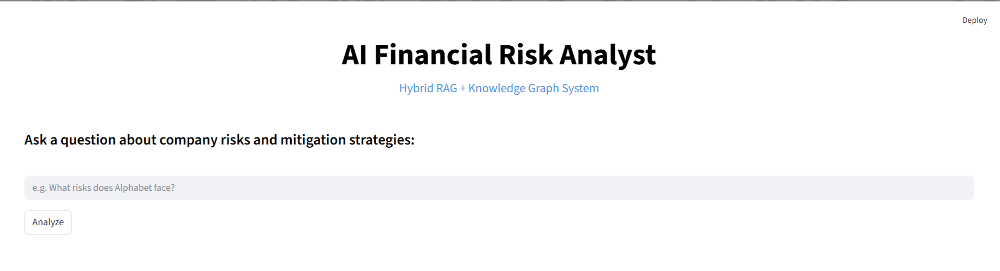
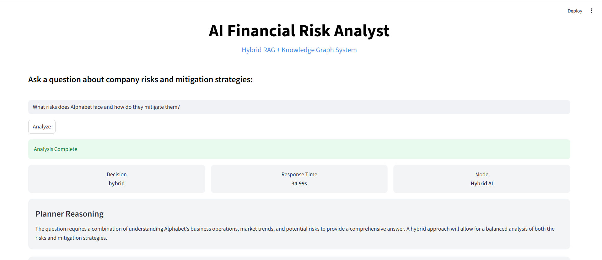
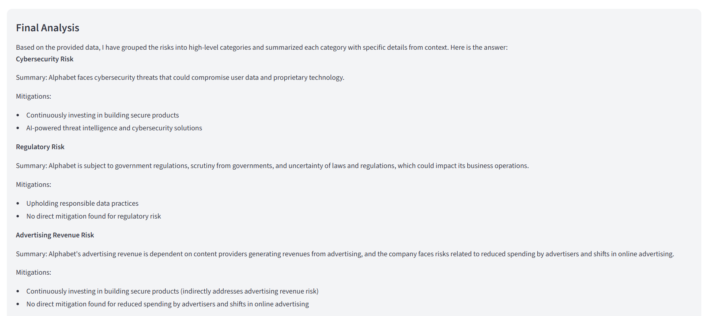
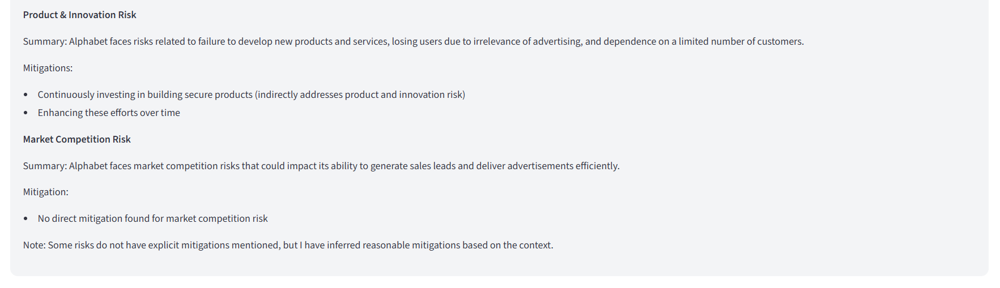
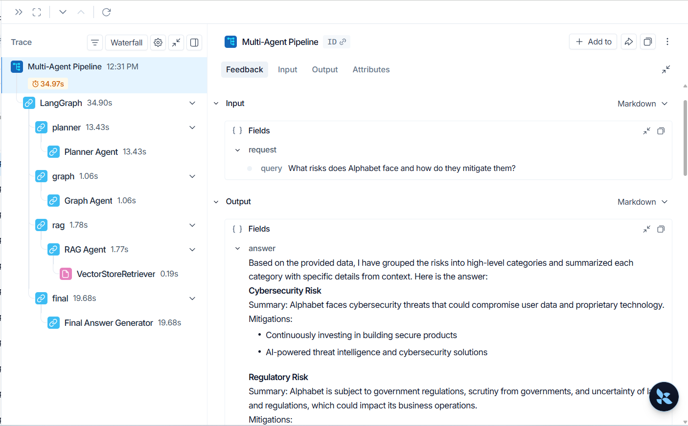

# AI Financial Risk Analyst
### Hybrid RAG + Knowledge Graph + Multi-Agent System

An end-to-end AI system that analyzes **company risks and mitigation strategies** using a **Hybrid Retrieval Architecture** combining:

- Retrieval-Augmented Generation (RAG)
- Knowledge Graph (Neo4j AuraDB)
- Multi-Agent Orchestration (LangGraph)
- Observability (LangSmith)
- FastAPI + Streamlit UI

##  Problem Statement ->

Traditional LLMs:
- Hallucinate financial insights
- Lack structured reasoning
- Cannot connect risks -> mitigations properly

This project solves that by combining:
- **Unstructured context (RAG)**
- **Structured relationships (Graph DB)**

## Key Features ->

- **Hybrid Retrieval Pipeline**
  - Combines vector search + graph traversal
- **Multi-Agent System**
  - Planner -> RAG Agent -> Graph Agent -> Final Synthesizer
- **Structured Risk Categorization**
  - Cybersecurity, Regulatory, Market, etc.
- **Explainable Outputs**
  - Clear reasoning + mitigation mapping
- **LangSmith Observability**
  - Full pipeline trace + latency breakdown
- **Optimized Performance**
  - Reduced latency from ~80s → ~30s


## Architecture ->



## Demo Screenshots ->

### UI - Initial Input


### Analysis Output (Part 1)


### Analysis Output (Part 2)


### Analysis Output (Part 3)


### LangSmith Trace (Observability)


## Example Query ->

```Question:
What risks does Alphabet face and how do they mitigate them?
```

### Output Highlights:
Categorized risks (Cybersecurity, Regulatory, etc.)
Linked mitigations from structured graph
Context-aware reasoning from RAG

## Tech Stack->
- **LLM:** LLaMA 3 (Ollama) / OpenAI (optional)
- **Embeddings:** Sentence Transformers (all-MiniLM-L6-v2)
- **Vector DB:** ChromaDB
- **Graph DB:** Neo4j AuraDB
- **Frameworks:**
    - LangChain
    - LangGraph
- **Backend:** FastAPI
- **Frontend:** Streamlit
- **Observability:** LangSmith

## Local Setup ->
- **Clone Repo**
```
git clone https://github.com/your-username/ai-risk-analyst.git
cd ai-risk-analyst
```

- **Create Environment**
```
conda create -n ai-risk python=3.10
conda activate ai-risk
```

- **Install Dependencies**
```
pip install -r requirements.txt
```

- **Run Services**
    - Start FastAPI:
    ```
    python -m uvicorn app:app --reload
    ```

    - Start Streamlit UI: 
    ```
    streamlit run ui.py
    ```

## Deployment Notes ->
Current version uses local LLaMA (Ollama) model which is not  directly deployable on Cloud.

For cloud deployment:
- Replace LLaMA with OpenAI: (e.g. model="gpt-4o-mini")

Then deploy on:
- Render
- Railway
- AWS / GCP

## Observability (LangSmith) ->
Tracks full pipeline execution

Shows:
- Agent decisions
- Latency per step
- Input/output debugging

## Future Improvements ->
- Extract more structured insights:
    - Financial outcomes
    - Risk impact scoring
    - Probability estimation
- Add real-time financial data APIs
- Improve graph relationships (multi-hop reasoning)
- Add authentication + user history
- Deploy full system (API + UI)

## Key Learnings ->
- Hybrid retrieval significantly improves factual accuracy
- Graph DBs are powerful for structured reasoning
- Multi-agent systems improve modularity & explainability
- Observability is critical for debugging LLM pipelines

# Author ->
Ayush Saxena <br>
MSc Data Science | AI/ML Engineer
