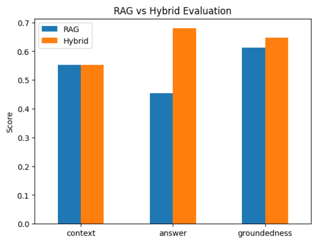
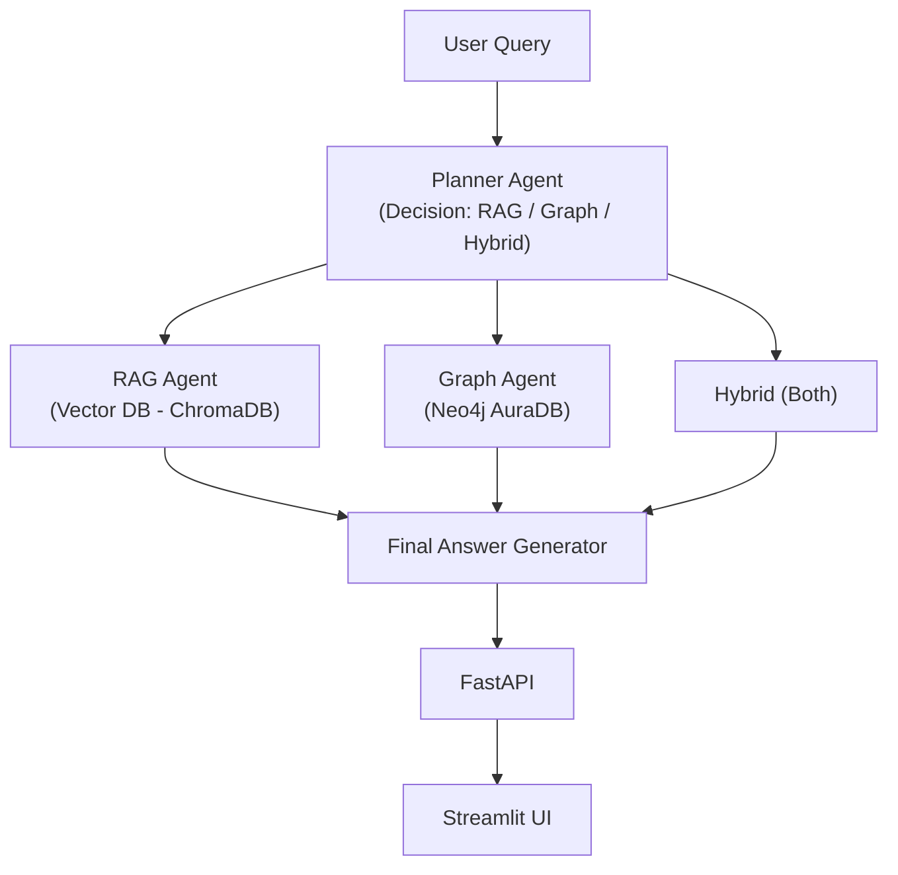

# AI Financial Risk Analyst
### Hybrid RAG + Knowledge Graph + Multi-Agent System

An end-to-end AI system that analyzes **company risks and mitigation strategies** using a **Hybrid Retrieval Architecture** combining:

- Retrieval-Augmented Generation <I>(RAG)</I>
- Knowledge Graph <I>(Neo4j AuraDB)</I>
- Multi-Agent Orchestration <I>(LangGraph)</I>
- Observability <I>(LangSmith)</I>
- FastAPI + Streamlit UI

##  Problem Statement ->

Traditional LLMs:
- Hallucinate financial insights
- Lack structured reasoning
- Cannot connect risks -> mitigations properly

This project solves that by combining:
- **Unstructured context <I>(RAG)</I>**
- **Structured relationships <I>(Graph DB)</I>**

## Key Features ->

- **Hybrid Retrieval Pipeline**
  - Combines vector search + graph traversal
- **Multi-Agent System**
  - Planner -> RAG Agent -> Graph Agent -> Final Synthesizer
- **Structured Risk Categorization**
  - Cybersecurity, Regulatory, Market, etc.
- **Explainable Outputs**
  - Clear reasoning + mitigation mapping
- **LangSmith Observability**
  - Full pipeline trace + latency breakdown
- **Optimized Performance**
  - Reduced latency

## Results & Evaluation ->

### Performance Improvements

- Reduced response time from **~80 seconds → ~30 seconds**
- Achieved **~62.5% latency reduction** through:
  - Optimized model loading
  - Efficient pipeline orchestration
  - Reduced redundant LLM calls

### Evaluation Metrics

The system was evaluated using key RAG quality metrics:

- **Answer Relevance** – Measures how well the answer matches the user query  
- **Groundedness** – Ensures answers are based on retrieved context <I>(reduces hallucination)</I>
- **Context Utilization** – Evaluates how effectively retrieved data is used  

### Quantitative Comparison: <I>RAG vs Hybrid System</I>

| Metric              | Baseline RAG | Hybrid <I>(RAG + Graph)</I> | Improvement |
|--------------------|-------------|---------------------|------------|
| Context Relevance  | 0.553       | 0.553               | (same retrieval base) |
| Answer Relevance   | 0.455       | 0.680               | +49% |
| Groundedness       | 0.613       | 0.646               | +5.4% |

### Evaluation Results

- **Answer relevance improved significantly (+49%)**
  - Hybrid system produces answers that better align with user intent

- **Groundedness improved (+5.4%)**
  - Knowledge Graph ensures stronger factual alignment with source data

- **Context relevance remains constant**
  - Since both systems use the same vector retrieval base

### Structural Improvement <I>(Beyond Metrics)</I>

While quantitative metrics show measurable gains, the **largest improvement is in answer structure and reasoning quality**, which is not fully captured by standard evaluation metrics.

Hybrid system enables:

- **Clear categorization of risks** <I>(e.g., Cybersecurity, Regulatory, Market)</I>
- **Explicit linking of risks -> mitigations**
- **More structured, readable outputs**
- **Improved logical flow and explainability**

In contrast, baseline RAG:

- Produces **less structured responses**
- Lacks **explicit relationships between entities**
- Is more prone to **flat or generic answers**

### Evaluation Visualization



###  Key Improvements

- High answer relevance across financial queries  
- Strong groundedness due to hybrid retrieval <I>(RAG + Graph)</I>
- Improved context utilization via structured + unstructured fusion  

### Key Insight

Hybrid architecture significantly improves:

- Factual accuracy <I>(vs pure LLM)</I>
- Reasoning depth <I>(vs pure RAG)</I>
- Explainability <I>(via structured graph relationships)</I>

## Architecture ->



## Demo Screenshots ->

### UI - Initial Input


### Analysis Output (Part 1)


### Analysis Output (Part 2)


### Analysis Output (Part 3)


### LangSmith Trace (Observability)


## Example Query ->

```Question:
What risks does Alphabet face and how do they mitigate them?
```

### Output Highlights:
Categorized risks <I>(Cybersecurity, Regulatory, etc.)</I>
Linked mitigations from structured graph
Context-aware reasoning from RAG

## Tech Stack->
- **LLM:** LLaMA 3 <I>(Ollama)</I>
- **Embeddings:** Sentence Transformers & Hugging Face Embeddings <I>(all-MiniLM-L6-v2)</I>
- **Vector DB:** ChromaDB
- **Graph DB:** Neo4j AuraDB
- **Frameworks:**
    - LangChain
    - LangGraph
- **Backend:** FastAPI
- **Frontend:** Streamlit
- **Observability:** LangSmith

## Local Setup ->
- **Clone Repo**
```
git clone https://github.com/your-username/ai-risk-analyst.git
cd ai-risk-analyst
```

- **Create Environment**
```
conda create -n ai-risk python=3.10
conda activate ai-risk
```

- **Install Dependencies**
```
pip install -r requirements.txt
```

- **Run Services**
    - Start FastAPI:
    ```
    python -m uvicorn app:app --reload
    ```

    - Start Streamlit UI: 
    ```
    streamlit run ui.py
    ```

## Deployment Notes ->
Current version uses local LLaMA <I>(Ollama)</I> model which is not  directly deployable on Cloud.

For cloud deployment:
- Replace LLaMA with OpenAI: <I>(e.g. model="gpt-4o-mini")</I>

Then deploy on:
- Render
- AWS
- Railway

## Observability (LangSmith) ->
Tracks full pipeline execution

Shows:
- Agent decisions
- Latency per step
- Input/output debugging

## Future Improvements ->
- Extract more structured insights:
    - Financial outcomes
    - Risk impact scoring
    - Probability estimation
- Add real-time financial data APIs
- Improve graph relationships <I>(multi-hop reasoning)</I>
- Add authentication + user history
- Deploy full system <I>(API + UI)</I>

## Key Learnings ->
- Hybrid retrieval significantly improves factual accuracy
- Graph DBs are powerful for structured reasoning
- Multi-agent systems improve modularity & explainability
- Observability is critical for debugging LLM pipelines

# Author ->
Ayush Saxena <br>
MSc Data Science | AI/ML Engineer